# Voting System

## Overview

The Voting System project is a full-stack application consisting of a frontend built with Angular and a backend API built with Node.js/Express. The system allows users to view topics, vote on options related to topics, and manage topic-related actions through a user-friendly interface.

## Features

### **Frontend:**
  - Display a list of topics and their details.
  - Select a topic and view its options.
  - Vote on options and submit votes.
  - Modal forms for creating and managing topics.

### **Backend:**
  - API endpoints for fetching and managing topics and votes.
  - Handling votes and tracking vote counts.

## Technologies Used

### **Frontend:**
  - Angular
  - Angular Material
  - TypeScript

### **Backend:**
  - Node.js/Express
  - Prisma ORM
  - MySQL Database

## Installation

### Prerequisites

- [Node.js](https://nodejs.org/) (v14 or later)
- [npm](https://www.npmjs.com/) (comes with Node.js)

### Frontend Setup

1. Clone the repository:

   ```bash
   git clone https://github.com/Sallmahussien/voting-system.git
   cd frontend
   ```

2. Install dependencies:

   ```bash
   npm install
   ```

3. Start the development server:

   ```bash
   ng serve
   ```

4. Open your browser and navigate to `http://localhost:4200` to see the application.

### Backend Setup

1. Clone the repository:

   ```bash
   git clone https://github.com/Sallmahussien/voting-system.git
   cd backend
   ```

2. Install dependencies:

   ```bash
   npm install
   ```

3. Set up the database and environment variables according to the instructions in `backend/README.md`.

4. Start the server:

   ```bash
   npm start
   ```

5. The API will be available at `http://localhost:8000`.

## Snapshots

### Homepage
  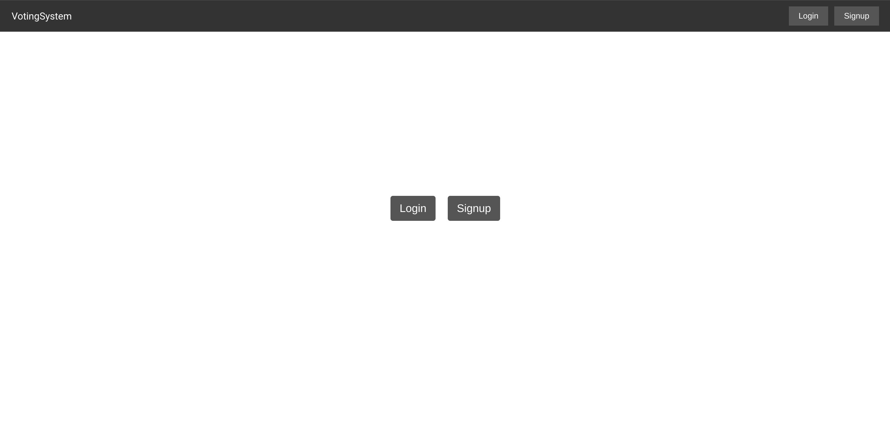

---

### Admin Interface

#### Admin Login
  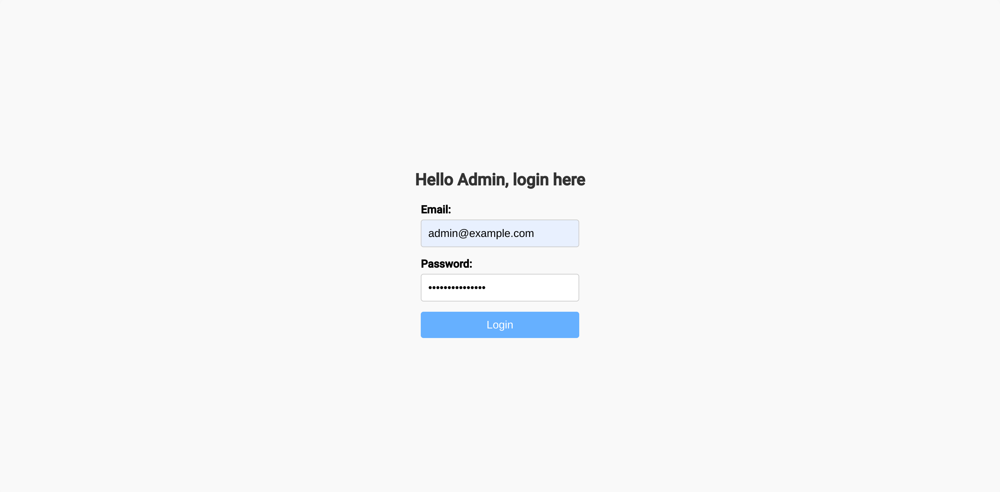
#### Create New Topic
  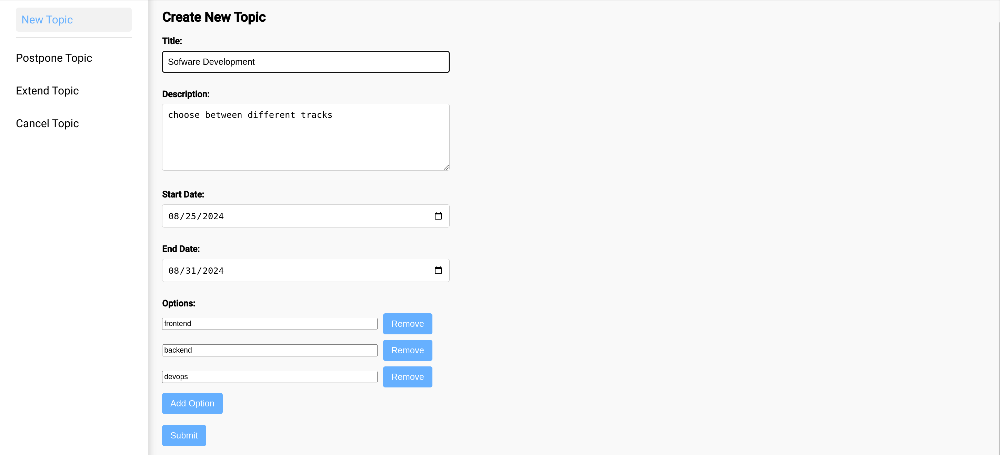
#### Postpone Topic
  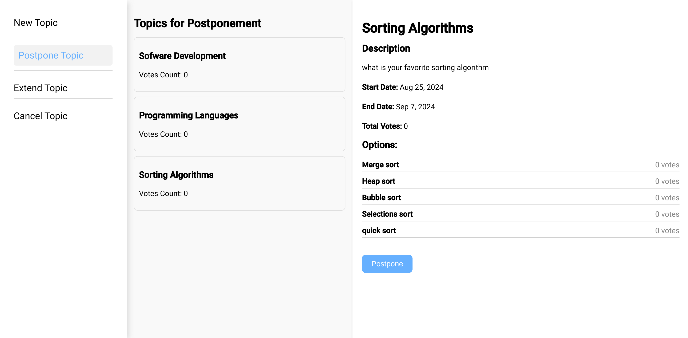
  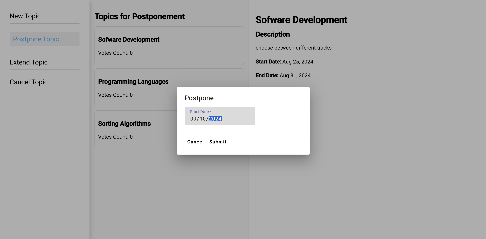
#### Extend Topic
  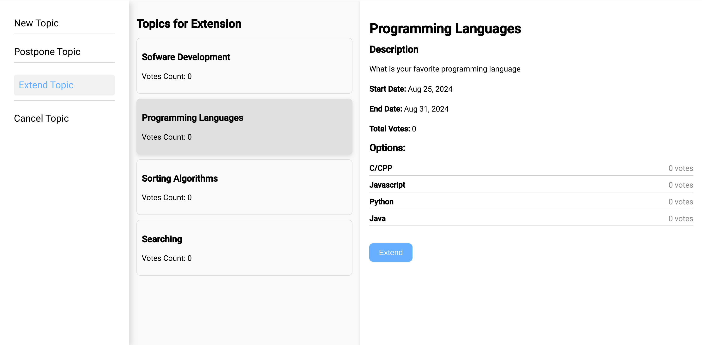
  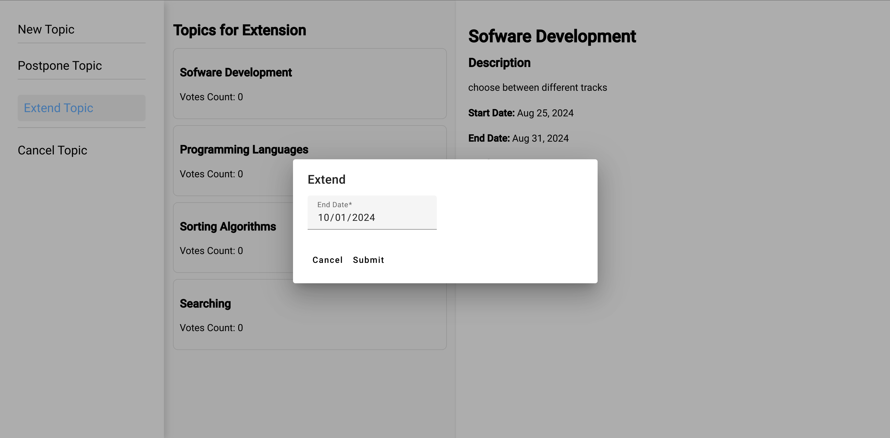
#### Cancel Topic
  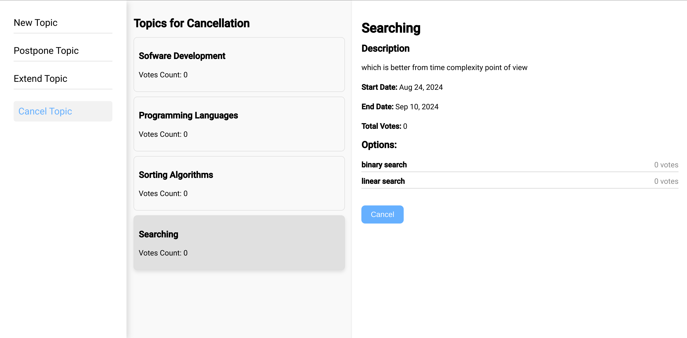

---

### User Interface

#### User Registration
  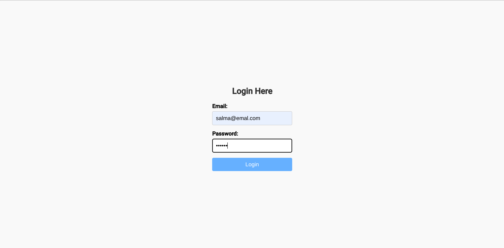
  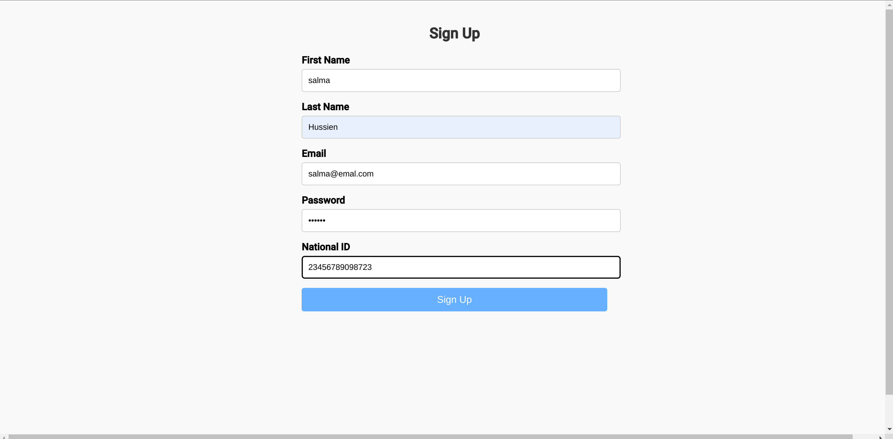
#### Current Topics
  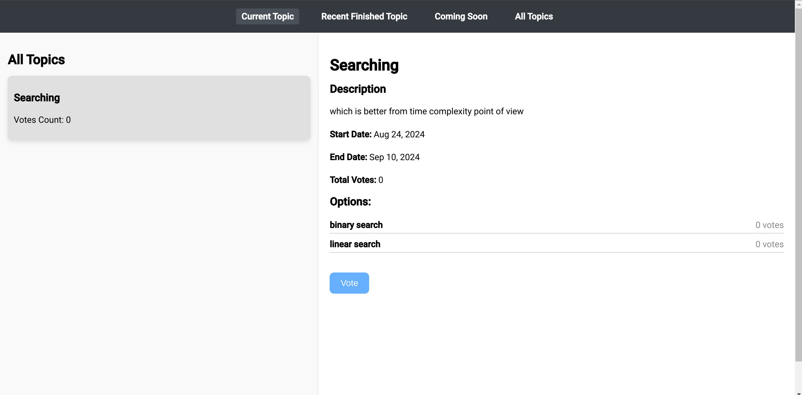
#### Voting for an option
  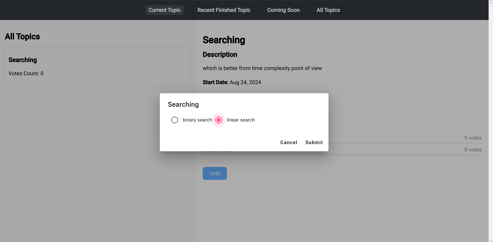
#### Recent Finished Topics
  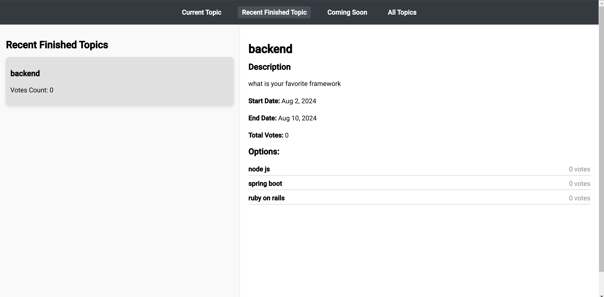
#### Coming Soon Topics
  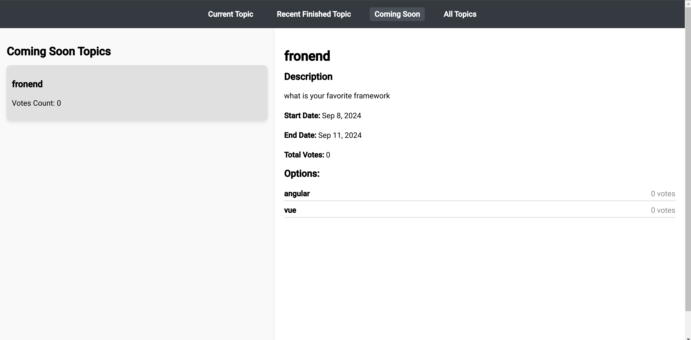
#### All Topics
  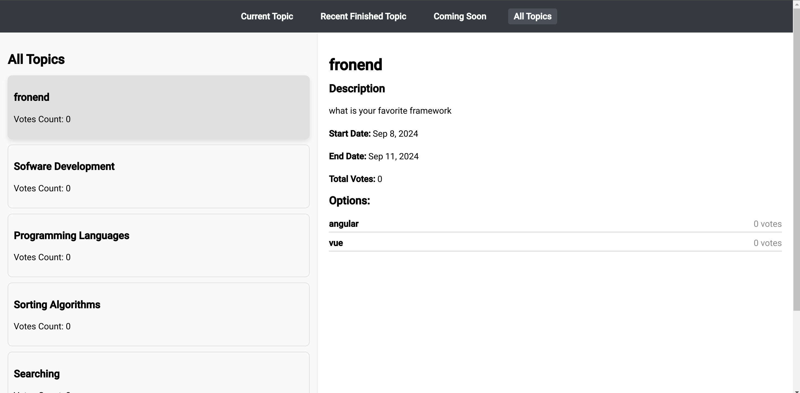

## License

This project is licensed under the MIT License. See the [LICENSE](https://github.com/Sallmahussien/voting-system/blob/main/LICENSE) file for details.

## Contact

For any questions or issues, please contact:

- **Salma Hussien** - [salmaa.hussien1@gmail.com](mailto:your-email@example.com)
- **GitHub:** [Sallmahussien](https://github.com/Sallmahussien/)